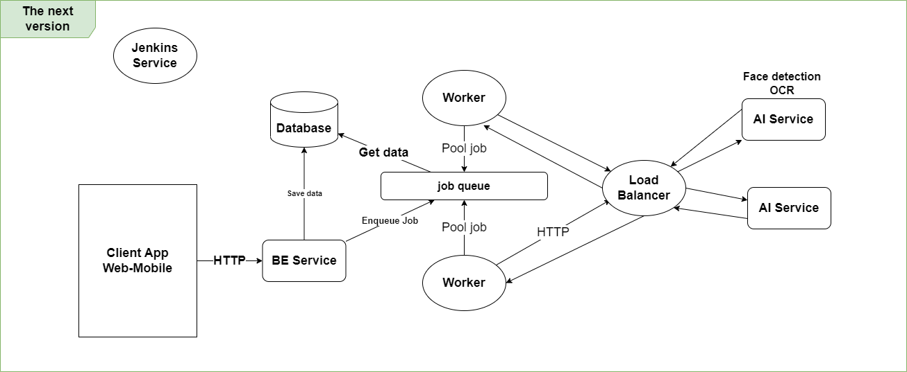

# KMS-PictureFinder-AI

## Video demo
Use this link: [https://youtu.be/_8mVyfxF-9o](https://youtu.be/_8mVyfxF-9o)

](https://youtu.be/_8mVyfxF-9o)

## Architecture

* **Current version**

* **The next version**

## Version 1.0.0

## Install and setup environment:

Local env:
`make install`

Docker version:
`make dc-up`

## Run:
- `make run`
