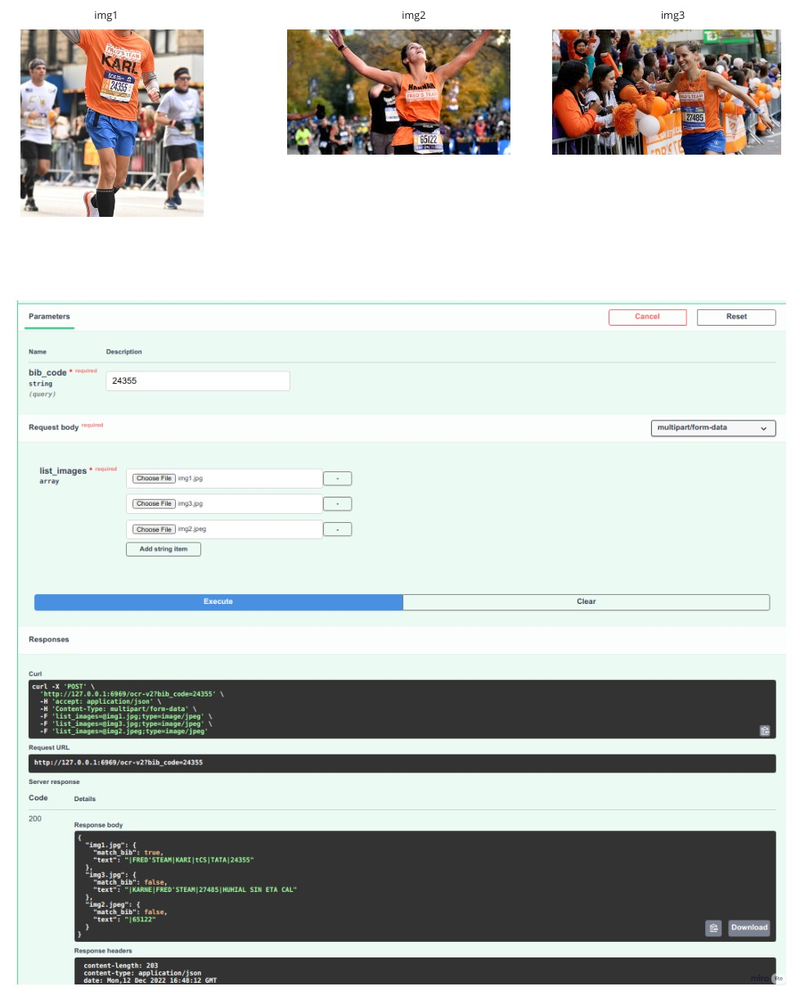

# KMS-PictureFinder-AI
```
In this version, Service AI provide 3 main feature:
- Find person in picture with the face (InsightFace)
- Find person in picture with BIB code (PaddleOCR)
- Find person in picture with Clothes (Openpifpaf + Histogram comparison)
```

## Result
### Find with BIB code

### Find with clothes

### Find with face


(replace the link youtube + "/sddefault.jpg" to get the maximum resolution thumbnail)

](https://youtu.be/nTQUwghvy5Q)

## Architecture

* **Current version**


* **The next version**


## Version 1.0.0

## Install and setup environment:

Local env:
`make install`

Docker version:
`make dc-up`

## Run:
- `make run`
